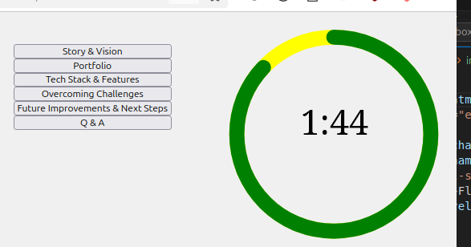

# DEMO DAY!!

## Timer
Put this together to provide a rudimentary timer for portfolio demo day.

Borrowed content from https://codepen.io/geoffgraham/pen/yLywVbW

VS-code, CoPilot helped to iron out some wrinkles

### Does..
- use variables hard coded into html and js
- sets and starts timer to interval (in seconds) on button click

### Does not..
- use a JSON
- provide text label indicating stage
- automatically rollover
- implement responsive